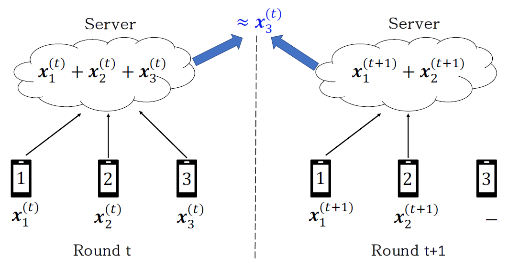

# Securing Secure Aggregation: Mitigating Multi-Round Privacy Leakage in Federated Learning


## Abstract

Secure aggregation is a critical component in federated learning, which enables the server to learn the aggregate model of the users without observing their local models. Conventionally, secure aggregation algorithms focus only on ensuring the privacy of individual users in a **single** training round. We contend that such designs can lead to significant privacy leakages over **multiple** training rounds, due to partial user selection/participation at each round of federated learning. In fact, we show that the conventional random user selection strategies for federated learning lead to leaking users' individual models within number of rounds linear in the number of users. To address this challenge, we introduce a secure aggregation framework with multi-round privacy guarantees. In particular, we introduce a new metric to quantify the privacy guarantees of federated learning over multiple training rounds, and develop a structured user selection strategy that guarantees the long-term privacy of each user (over any number of training rounds). Our framework also carefully accounts for the fairness and the average number of participating users at each round. We perform several experiments on MNIST and CIFAR-10 datasets in the IID and the non-IID settings to demonstrate the performance improvement over the baseline algorithms, both in terms of privacy protection and test accuracy. 





## Environment Setup

```python
pip install scipy 
pip install numpy
pip install torch
pip install torchvision
```


# Experiment 

### 0. Construct "privacy-preserving family set" by utilizing batch partitioning (Section 4)

ex) When you want to generate it with parameters N=120, K=12, T=6, you can generate the set by using the following code.

```python
from utils.functions import CodeBookDesign_Bin

N, K, T = 120, 12, 6
Codebook_Proposed_T6 = CodeBookDesign_Bin(N,K,T)
```


### 1. Simulation for three key metrics 

You can find simulation results in the following code.

```python
MultiRound_FL_KeyMetrics.ipynb
```

  


### 2. Experiments for test accuracy 

You can find the experiment results to train CNN/LeNet on the CIFAR-10/MNIST dataset in the following codes.

```
CIFAR-10_IID_LeNet.ipynb
CIFAR-10_NonIID_LeNet.ipynb
MNIST_IID_CNN.ipynb
MNIST_NonIID_CNN.ipynb
```

Test accuracy to train the LeNet on the CIFAR-10 dataset with IID and Non-IID settings. (N=120, K=12)

 


